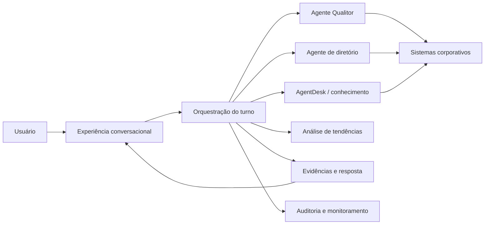
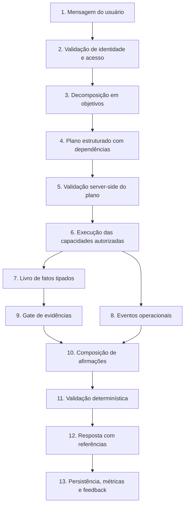
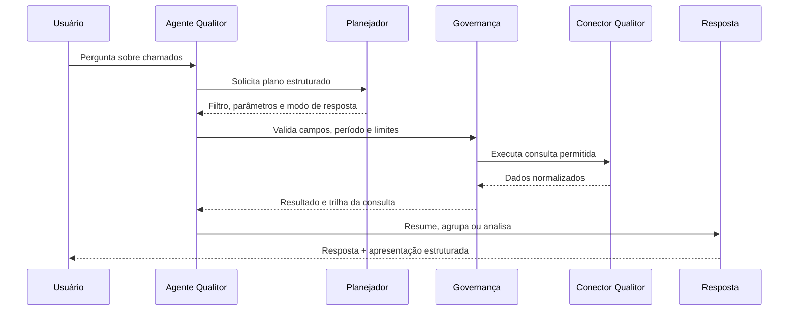
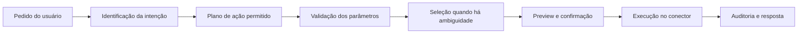
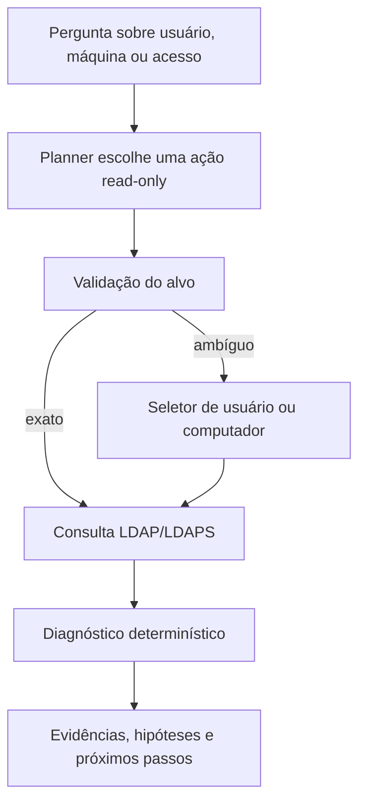
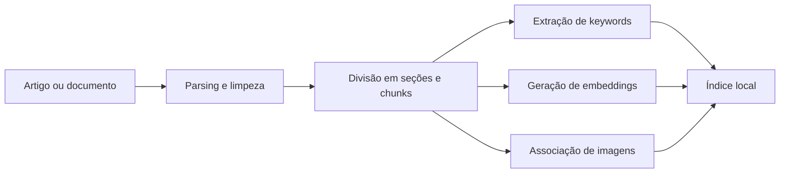
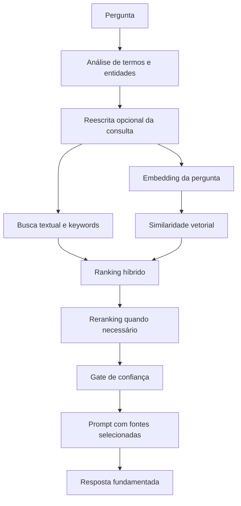
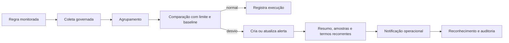
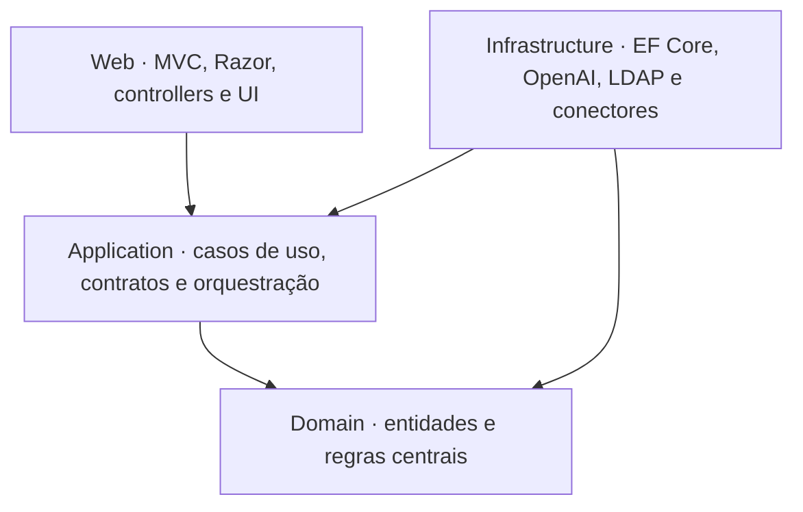

# AgentFlow

### Plataforma de agentes de IA para suporte corporativo

[](#sobre-este-case)
[](#stack-e-motiva%C3%A7%C3%B5es)
[](#stack-e-motiva%C3%A7%C3%B5es)
[](#busca-de-conhecimento-e-embeddings)
[](#estado-atual)

O AgentFlow é uma plataforma web que reúne agentes especializados, busca de conhecimento, integrações corporativas e observabilidade em uma experiência conversacional única. A proposta é permitir que uma pergunta de suporte seja compreendida, planejada, investigada em fontes autorizadas e respondida com evidências — sem transformar o modelo de linguagem na autoridade final sobre dados ou operações.

> [!IMPORTANT]
> Este repositório é um **case técnico de portfólio**. Ele não contém o código-fonte do sistema, credenciais, configurações de ambiente, documentos internos ou dados operacionais. Screenshots e exemplos utilizam informações fictícias ou anonimizadas.

## Sumário

- [Sobre este case](#sobre-este-case)
- [Como o projeto surgiu](#como-o-projeto-surgiu)
- [Problema e proposta](#problema-e-proposta)
- [Visão funcional](#visão-funcional)
- [Fluxo real de uma investigação](#fluxo-real-de-uma-investigação)
- [Agente Qualitor](#agente-qualitor)
- [Agente de Active Directory](#agente-de-active-directory)
- [Busca de conhecimento e embeddings](#busca-de-conhecimento-e-embeddings)
- [Análise de tendências](#análise-de-tendências)
- [Monitoramento e observabilidade](#monitoramento-e-observabilidade)
- [Arquitetura](#arquitetura)
- [Stack e motivações](#stack-e-motivações)
- [Principais decisões de engenharia](#principais-decisões-de-engenharia)
- [Segurança e privacidade](#segurança-e-privacidade)
- [Demonstrações](#demonstrações)
- [Aprendizados e próximos passos](#aprendizados-e-próximos-passos)

## Sobre este case

Esta documentação apresenta a ideia, a evolução, os fluxos e as decisões de engenharia do AgentFlow. O objetivo não é distribuir o sistema original, mas demonstrar como enfrentei problemas reais de arquitetura, integração, recuperação de conhecimento, segurança e experiência do usuário.

Os nomes de produtos amplamente conhecidos, como Qualitor e Active Directory, são citados apenas para contextualizar as integrações. Dados de pessoas, unidades, chamados, infraestrutura e regras internas não fazem parte deste material.

## Como o projeto surgiu

O AgentFlow começou como um projeto pessoal de portfólio, criado para aprofundar meu desenvolvimento em C#, ASP.NET Core, arquitetura de software e aplicações com modelos de linguagem.

À medida que o projeto amadureceu, percebi que a ideia poderia ser adaptada para desafios encontrados na empresa em que trabalho atualmente: conhecimento distribuído, consultas repetitivas, múltiplos sistemas de suporte e dificuldade de reunir contexto durante um atendimento.

A partir daí, o projeto deixou de ser apenas uma demonstração técnica e passou a explorar cenários corporativos reais. Por esse motivo, este case preserva os conceitos e os fluxos de engenharia, mas substitui dados e detalhes do ambiente por exemplos fictícios. Algumas telas também podem ser recriadas ou sanitizadas especificamente para o portfólio.

Essa origem influenciou uma decisão importante: o sistema precisava continuar sendo um espaço de aprendizado, mas com preocupações reais de segurança, rastreabilidade, confiabilidade e manutenção.

## Problema e proposta

No suporte corporativo, uma solicitação raramente depende de uma única fonte. Para investigar um incidente, o analista pode precisar:

- Ler o chamado e seu histórico.
- Localizar um procedimento oficial.
- Comparar o caso com chamados resolvidos.
- Verificar informações atuais em um diretório corporativo.
- Identificar recorrência ou aumento anormal de ocorrências.
- Registrar o que foi consultado e quanto tempo cada etapa levou.

O AgentFlow atua como uma camada de orquestração entre o usuário, os agentes especializados e as fontes autorizadas. Em vez de apenas enviar uma pergunta para uma IA, ele transforma a solicitação em um plano controlado, coleta dados, filtra evidências e só então monta a resposta.

## Visão funcional



### Capacidades apresentadas

| Área | O que resolve |
|---|---|
| Conversa | Mantém histórico, seleciona o agente e registra cada execução. |
| Qualitor | Consulta chamados, resume dados, encontra casos semelhantes e conduz operações controladas. |
| Active Directory | Pesquisa usuários, computadores e grupos e apoia diagnósticos somente leitura. |
| AgentDesk | Recupera artigos, documentos, imagens aprovadas e chamados resolvidos relacionados. |
| Tendências | Identifica concentrações e desvios no volume de chamados e gera alertas investigáveis. |
| Observabilidade | Mostra etapas em tempo real e persiste duração, fontes, decisões e falhas. |

## Fluxo real de uma investigação

O fluxo investigativo mais recente foi desenhado para evitar o padrão frágil de “a IA escolhe uma ferramenta, executa e decide novamente”. O plano completo é criado antes da execução e validado pelo backend.



### 1. Entrada e controle de acesso

A aplicação identifica o usuário, valida seu acesso ao agente selecionado e recupera o histórico necessário. A conversa e a mensagem são persistidas antes de iniciar a investigação, permitindo rastreabilidade mesmo quando uma etapa posterior falha.

### 2. Decomposição da pergunta

Uma mensagem pode conter mais de um objetivo. Por exemplo: ler um chamado, localizar o procedimento relacionado e verificar o estado atual de um usuário. O planejador recebe um catálogo fechado de capacidades e produz um plano estruturado com etapas, argumentos e dependências.

### 3. Validação do plano

O modelo propõe; o backend decide se o plano pode ser executado. A validação confere:

- Se a capacidade existe e está disponível.
- Se ela é compatível com o modo de execução atual.
- Se os parâmetros pertencem ao contrato permitido.
- Se identificadores vieram do usuário ou de fatos já confirmados.
- Se limites de quantidade, tempo e tamanho estão sendo respeitados.
- Se uma operação equivalente já foi executada naquele turno.

### 4. Livro de fatos e dependências

Cada capacidade produz fatos tipados. A leitura de um chamado pode produzir título, descrição, categoria e solicitante. Esses fatos alimentam etapas posteriores sem depender de a IA copiar e reinterpretar o texto livremente.

```text
Leitura do chamado
  ├─ produz descrição ──> busca de documentação
  ├─ produz categoria ──> busca de casos semelhantes
  └─ produz solicitante ─> diagnóstico de diretório
```

### 5. Execução isolada

As capacidades possuem timeout e fingerprint. O fingerprint combina a capacidade com argumentos normalizados, impedindo que a mesma consulta seja repetida apenas porque a pergunta foi reformulada. Falhas independentes não cancelam necessariamente toda a investigação: o sistema pode entregar uma resposta parcial e declarar qual fonte não pôde ser validada.

### 6. Gate de evidências

Nem todo resultado consultado vira evidência. Antes de ser enviado à resposta, o conteúdo passa por critérios como score mínimo, compatibilidade lexical, deduplicação, limite por documento, orçamento total, sanitização e aprovação explícita de imagens.

### 7. Resposta verificável

A resposta é produzida como uma coleção de afirmações estruturadas. Fatos internos e procedimentos documentados precisam apontar para evidências válidas; limitações operacionais apontam para eventos de execução. Afirmações internas sem suporte são removidas pelo servidor antes da renderização.

## Agente Qualitor

O Agente Qualitor concentra os fluxos relacionados ao sistema de chamados. Ele interpreta solicitações em linguagem natural, mas trabalha com catálogos fechados de consultas e ações.

### Consulta de chamados



O sistema não aceita SQL livre produzido pelo modelo como autoridade. O planejador seleciona filtros e parâmetros; o backend monta e governa a consulta, aplica limites e registra sua execução.

Dependendo da pergunta, a resposta pode assumir formatos diferentes: lista objetiva, detalhamento, agrupamento por status ou categoria, evolução temporal e análise assistida.

### Operações controladas

O módulo especializado também foi projetado para conduzir operações como abertura ou atualização de chamados. Ações de maior impacto passam por preparação, preview e confirmação explícita.



Essa separação é importante: o agente investigativo principal opera somente em leitura, enquanto operações de escrita ficam em fluxos especializados com controles próprios.

### Chamados semelhantes

O Agente Qualitor também pode procurar chamados resolvidos parecidos. A busca usa descrição, categoria e termos técnicos para localizar precedentes. O resultado é apresentado como referência histórica, não como regra ou procedimento oficial.

## Agente de Active Directory

O Agente AD foi desenhado para apoiar pesquisas e diagnósticos sem alterar o diretório. Ele pode consultar usuários, computadores, grupos efetivos e sinais relacionados a falhas de logon.



Decisões importantes desse fluxo:

- Catálogo fechado de ações somente leitura.
- Pesquisa de candidatos quando o nome não identifica um objeto único.
- Resolução de grupos efetivos, incluindo associações aninhadas.
- Separação explícita entre fato encontrado e hipótese diagnóstica.
- Fallback determinístico quando o planejador não retorna uma estrutura válida.
- Mensagens de erro seguras, sem expor servidor, credencial ou detalhes desnecessários.

O agente conversacional não troca senha, desbloqueia conta, altera grupos, move objetos ou modifica políticas.

## Busca de conhecimento e embeddings

O AgentDesk é o subsistema responsável pela recuperação de conhecimento. Ele combina busca textual, keywords, embeddings, reescrita de consulta, reranking e feedback.

### Por que embeddings?

Uma busca textual funciona bem quando pergunta e documento utilizam as mesmas palavras. Em suporte, isso nem sempre acontece: “terminal sem comunicação” e “equipamento offline” podem representar o mesmo problema sem compartilhar todos os termos.

Embeddings transformam textos em vetores numéricos. Textos semanticamente próximos tendem a ocupar regiões semelhantes nesse espaço vetorial. O AgentFlow utiliza o modelo `text-embedding-3-small` e similaridade de cosseno para comparar a pergunta com chunks de documentos e chamados resolvidos.

Embeddings não substituem a busca textual. Eles compõem uma busca híbrida porque códigos, mensagens de erro e nomes de sistemas costumam exigir correspondência lexical exata.

### Indexação



Os documentos são limpos e divididos em trechos menores para que a recuperação encontre a parte relevante, em vez de enviar artigos inteiros ao modelo. O índice mantém texto, keywords, vetor, origem, versão e metadados necessários para ranking e auditoria.

### Recuperação



O ranking considera múltiplos sinais, como:

- Correspondência de keywords e termos fortes.
- Similaridade semântica por embedding.
- Presença de códigos, erros, sistemas e equipamentos.
- Compatibilidade de título e especificidade do trecho.
- Recência e estado do conteúdo indexado.
- Feedback anterior sobre fontes utilizadas.
- Diversidade de artigos, evitando muitos chunks da mesma origem.

Se a busca semântica falhar ou exceder o timeout, o fluxo continua com sinais textuais. Se a confiança permanecer baixa, o sistema pode pedir mais contexto em vez de apresentar uma resposta interna como se estivesse confirmada.

## Análise de tendências

A análise de tendências serve para transformar o histórico de chamados em sinais operacionais. O objetivo não é apenas saber quantos chamados existem, mas identificar concentrações e desvios que merecem investigação antes que se tornem um problema maior.

### Painel estatístico

Um job agendado importa dados das categorias monitoradas e cria snapshots diários. O volume atual é comparado com um baseline formado pela média de dias anteriores disponíveis. Limiares configuráveis geram alertas de aumento ou queda.

O painel apresenta:

- Alertas ativos e reconhecidos.
- Categorias com maior volume.
- Ranking de unidades por quantidade e média diária.
- Comparação com período anterior.
- Evolução diária.
- Última importação realizada.
- Exportação de indicadores para análise complementar.

### Gestão de problemas baseada em regras

Uma segunda camada permite criar regras de tendência mais específicas. O usuário descreve o que deseja monitorar em linguagem natural e a IA sugere uma regra estruturada. Antes de ser salva, a regra passa por normalização e pode ser revisada.

As regras podem combinar:

- Janela atual, últimas horas ou período móvel.
- Agrupamento por unidade, categoria, dia, localidade ou hora.
- Palavras obrigatórias e termos excluídos.
- Categorias, situações, severidades e equipes permitidas.
- Limite absoluto de ocorrências.
- Comparação com média histórica por multiplicador.



Uma tendência não é tratada automaticamente como causa raiz. Ela é um indício priorizado, acompanhado de amostras e termos recorrentes para que uma pessoa investigue o contexto.

## Monitoramento e observabilidade

Como uma resposta pode depender de várias fontes, registrar apenas “sucesso” ou “falha” seria insuficiente. O AgentFlow acompanha a execução em dois níveis.

### Live trace

Durante uma pergunta, um painel de progresso apresenta etapas como análise, planejamento, busca local, embeddings, consulta a conectores, reranking e geração da resposta. Cada evento informa estágio, tempo acumulado e detalhes seguros para diagnóstico.

### Histórico persistido

Cada execução registra:

- Agente e conversa relacionados.
- Status final e duração.
- Quantidade de contexto documental e de conectores.
- Documentos e conectores utilizados.
- Modo de seleção do fluxo.
- Etapas e ações identificadas.
- Falhas ou limitações operacionais.
- Feedback de utilidade fornecido pelo usuário.

O painel administrativo permite analisar taxa de sucesso, duração média, uso de fontes, decisões do planner, fallbacks e falhas. O feedback também pode ajustar a relevância futura de artigos e keywords sem apagar a trilha original.

Jobs recorrentes e workers cuidam de tarefas como reindexação, hidratação de conteúdo, expiração de ações temporárias, notificações e importação para análise de tendências.

## Arquitetura

O projeto segue Clean Architecture, com dependência direcionada para contratos e regras centrais.



```text
AgentFlow/
├── Domain/           # Entidades, estados e regras centrais
├── Application/      # Casos de uso, contratos, planners e orquestração
├── Infrastructure/   # Persistência, OpenAI, LDAP, Qualitor e processamento
└── Web/              # ASP.NET Core MVC, Razor Views, CSS e JavaScript
```

Mais detalhes estão em [docs/ARCHITECTURE.md](docs/ARCHITECTURE.md).

## Stack e motivações

| Tecnologia | Uso | Motivo da escolha |
|---|---|---|
| .NET 9 e C# | Plataforma principal | Tipagem forte, async/await, DI nativa e bom suporte a aplicações corporativas. |
| ASP.NET Core MVC | Aplicação web | Adequado ao ambiente .NET, renderização server-side e integração direta com Identity. |
| Razor Views | Interface | Permite evoluir a UI sem introduzir um segundo ecossistema de build. |
| Entity Framework Core 9 | Persistência | Mapeamento de domínio, migrations e consultas LINQ integradas ao SQL Server. |
| SQL Server | Dados transacionais | Compatibilidade com o ambiente corporativo e suporte ao histórico operacional. |
| OpenAI API | Planejamento e respostas | Saída estruturada, interpretação de linguagem natural e síntese baseada em contexto. |
| `text-embedding-3-small` | Busca semântica | Vetorização com bom equilíbrio entre qualidade, custo e latência para recuperação. |
| LDAP/LDAPS | Diretório corporativo | Consulta controlada de usuários, computadores e grupos. |
| Hangfire | Jobs recorrentes | Agendamento persistido, retentativas e visibilidade operacional. |
| Bootstrap 5 | Design responsivo | Componentes acessíveis e produtivos sem exigir bundler. |
| JavaScript e jQuery | Interações da UI | Compatibilidade com a aplicação existente e baixo custo de adoção incremental. |

As versões e provedores apresentados refletem a implementação estudada, mas configurações reais não fazem parte deste repositório.

## Principais decisões de engenharia

| Decisão | Motivo |
|---|---|
| Modelo propõe, backend valida | Evita transformar uma saída probabilística em autorização operacional. |
| Catálogos fechados de capabilities e ações | Limita o espaço de decisão e permite validação previsível. |
| Plano completo antes da execução | Reduz chamadas repetidas e preserva dependências entre objetivos. |
| Fatos tipados entre etapas | Evita que identificadores e resultados sejam recriados livremente pela IA. |
| Busca híbrida | Combina precisão lexical com proximidade semântica. |
| Gate de evidências | Impede que qualquer resultado de baixa qualidade seja apresentado como fonte. |
| Resposta por afirmações verificáveis | Permite remover fatos internos que não tenham evidência válida. |
| Resposta parcial em falhas independentes | Mantém o que foi confirmado sem esconder indisponibilidade de outra fonte. |
| Confirmação para ações sensíveis | Mantém uma pessoa no controle do efeito externo. |
| Observabilidade por etapa | Torna possível entender latência, seleção de fontes e falhas do pipeline. |
| Processamento assíncrono para indexação | Separa tarefas pesadas da experiência imediata do chat. |

O racional completo está em [docs/TECHNICAL-DECISIONS.md](docs/TECHNICAL-DECISIONS.md).

## Segurança e privacidade

Os principais controles considerados no desenho são:

- Autenticação e autorização server-side.
- Menor privilégio para conectores e capabilities.
- Fluxos read-only por padrão no agente investigativo.
- Preview e confirmação humana para operações sensíveis.
- Credenciais fora do código e protegidas na persistência quando necessário.
- Queries governadas, com campos e limites permitidos.
- Timeouts, limites de passos e orçamento de contexto.
- Tratamento do conteúdo recuperado como entrada não confiável.
- Separação entre evidência e erro operacional.
- Sanitização de conteúdo antes do envio ao modelo e da persistência.
- Auditoria de consultas, ações, alertas e feedback.
- Imagens incluídas na resposta somente quando aprovadas.

Este case público aplica uma camada adicional: todos os exemplos devem ser sintéticos, e qualquer associação nominal com a empresa depende de autorização.

## Demonstrações

Os screenshots serão adicionados somente depois de uma revisão específica de privacidade.

| Demonstração | O que pretende mostrar | Imagem |
|---|---|---|
| Home do AgentFlow | Seleção de agentes e início da conversa | `assets/home.png` |
| Agente Qualitor | Consulta de um chamado fictício | `assets/agente-qualitor.png` |
| Investigação | Resposta fundamentada em múltiplas fontes | `assets/investigacao.png` |
| AgentDesk | Resposta baseada em artigo sintético | `assets/agentdesk.png` |
| Tendências | Dashboard com dados simulados | `assets/tendencias.png` |
| Monitoramento | Live trace ou execução sanitizada | `assets/monitoramento.png` |

Consulte [assets/README.md](assets/README.md) antes de adicionar as imagens.

## Aprendizados e próximos passos

O desenvolvimento reforçou alguns aprendizados:

- Integração com IA exige mais engenharia de controle do que engenharia de prompt.
- Recuperação precisa ser medida e filtrada antes da geração da resposta.
- Falha de uma fonte não pode ser convertida em conclusão sobre o estado do negócio.
- Observabilidade é parte do produto quando o fluxo possui várias decisões invisíveis.
- Ações corporativas precisam de autorização e auditoria fora do modelo.
- Dados históricos podem orientar uma investigação, mas não substituem procedimentos oficiais.

Próximos passos técnicos considerados:

- Criar um conjunto de evals com perguntas, fontes e respostas esperadas.
- Calibrar thresholds de ranking por domínio e tipo de documento.
- Transmitir progresso no chat por eventos server-side.
- Ampliar políticas por capability, perfil e sensibilidade do campo.
- Evoluir comparação determinística entre requisitos documentados e estado atual.
- Medir latência, custo, fontes rejeitadas e afirmações removidas.

## Estado atual

O AgentFlow permanece em evolução. Este case descreve decisões e capacidades implementadas ou exploradas no projeto, mas não representa uma distribuição pública pronta para implantação.

## Aviso

Todos os exemplos deste repositório devem usar dados fictícios. Qualitor, Active Directory, OpenAI e demais marcas citadas pertencem aos seus respectivos titulares. A menção não implica parceria, endosso ou divulgação de informações dos fornecedores ou da empresa em que o projeto foi adaptado.

