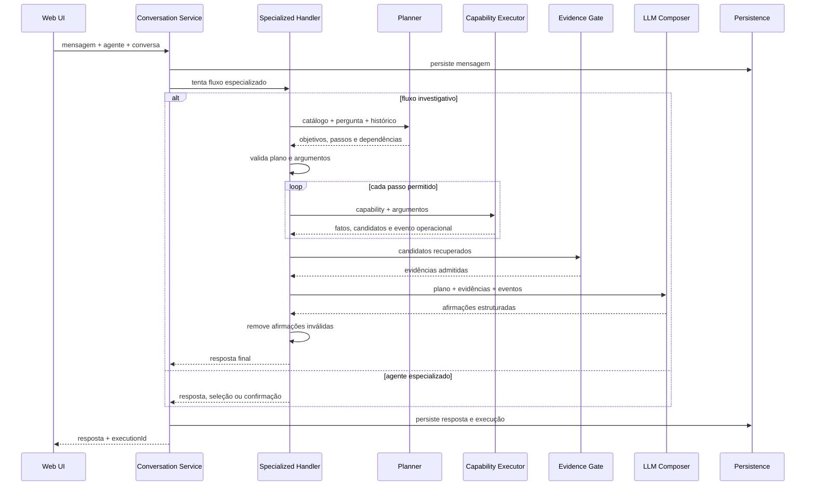

# Arquitetura do AgentFlow

Este documento aprofunda a arquitetura apresentada no README sem revelar configurações, schemas ou identificadores do ambiente original.

## Princípios

1. O modelo de linguagem interpreta e propõe; a aplicação valida e executa.
2. As integrações são acessadas por contratos definidos na camada Application.
3. Dados recuperados são tratados como não confiáveis até passarem pelos gates do fluxo.
4. Uma falha operacional não pode ser usada como evidência de negócio.
5. Ações com efeito externo exigem um fluxo mais restritivo do que consultas.

## Camadas

### Domain

Contém entidades e estados centrais: agentes, conversas, mensagens, execuções, documentos, chunks, feedback, alertas e configurações de tendência. Não depende de detalhes de HTTP, banco ou OpenAI.

### Application

Define casos de uso e contratos. Nessa camada vivem os turn handlers especializados, planners, catálogos de ações, modelos de fatos e evidências, regras de prompting e orquestração.

### Infrastructure

Implementa persistência e integrações técnicas: EF Core, SQL Server, OpenAI, LDAP/LDAPS, Qualitor, parsing, embeddings, ranking, filas e workers.

### Web

Expõe a aplicação em ASP.NET Core MVC. Controllers validam acesso e CSRF; ViewModels preparam os dados; Razor Views e scripts implementam chat, dashboards, seletores, confirmações e live trace.

## Fluxo conversacional

## Recuperação de conhecimento

### Ingestão

1. Descoberta ou importação da fonte.
2. Hidratação do conteúdo completo.
3. Limpeza de HTML ou parsing do documento.
4. Separação em seções e chunks.
5. Extração de keywords.
6. Geração de embeddings.
7. Associação e análise controlada de imagens.
8. Persistência da versão indexada.

### Consulta

1. Normalização da pergunta.
2. Extração de termos fortes, códigos, sintomas, erros, sistemas e equipamentos.
3. Reescrita semântica opcional.
4. Busca textual e por keywords.
5. Geração do embedding da consulta.
6. Comparação vetorial por similaridade de cosseno.
7. Fusão e ranking dos candidatos.
8. Hidratação de fontes incompletas quando necessário.
9. Reranking de candidatos ambíguos.
10. Corte por confiança e diversidade.
11. Montagem do prompt somente com fontes admitidas.
12. Registro de analytics e feedback.

## Limites entre leitura e escrita

O agente investigativo principal trabalha com capabilities declaradas como somente leitura. Operações como abertura ou atualização de chamado não são adicionadas silenciosamente a esse catálogo.

Elas pertencem a módulos especializados, que aplicam:

- Intenção operacional explícita.
- Catálogo de operações permitido.
- Resolução de parâmetros e ambiguidades.
- Preview do efeito esperado.
- Confirmação do usuário quando exigida.
- Execução por um serviço específico.
- Auditoria do resultado.

## Resiliência

- Timeout por capability e limite total do turno.
- Fingerprint para evitar execução duplicada.
- Fallback textual quando embeddings não estão disponíveis.
- Fallback determinístico quando um planner retorna formato inválido.
- Preservação de resultados parciais.
- Jobs idempotentes onde a reimportação é prevista.
- Filas em background para tarefas pesadas de indexação.

## Observabilidade

O live trace acompanha etapas efêmeras da requisição. O histórico persistido registra o resultado consolidado, incluindo duração, status, fontes e decisões. Os dois mecanismos têm finalidades diferentes: experiência e diagnóstico imediato no primeiro; auditoria e análise histórica no segundo.

